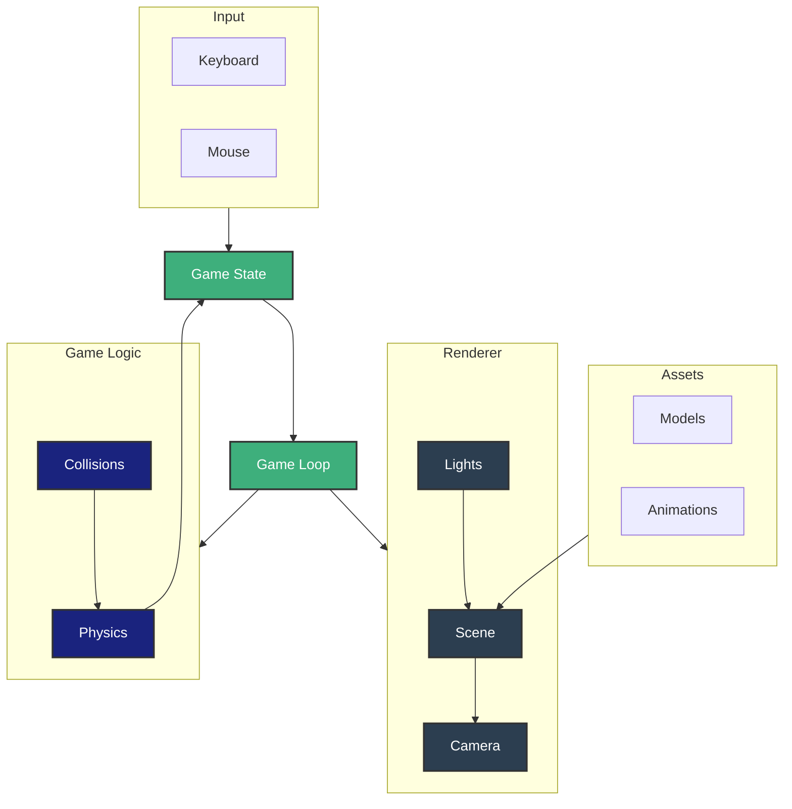

# Core Game Architecture

## Main Components

### Game Loop & State
- Controls the game's heartbeat
- Manages game state and updates
- Coordinates systems communication

### Renderer
- Scene: 3D world container
- Camera: Player's view
- Lights: World illumination

### Game Logic
- Physics: Movement and forces
- Collisions: Object interactions

### Assets
- Models: 3D objects and characters
- Animations: Movement sequences

### Input
- Keyboard: Movement and actions
- Mouse: Camera control and targeting
