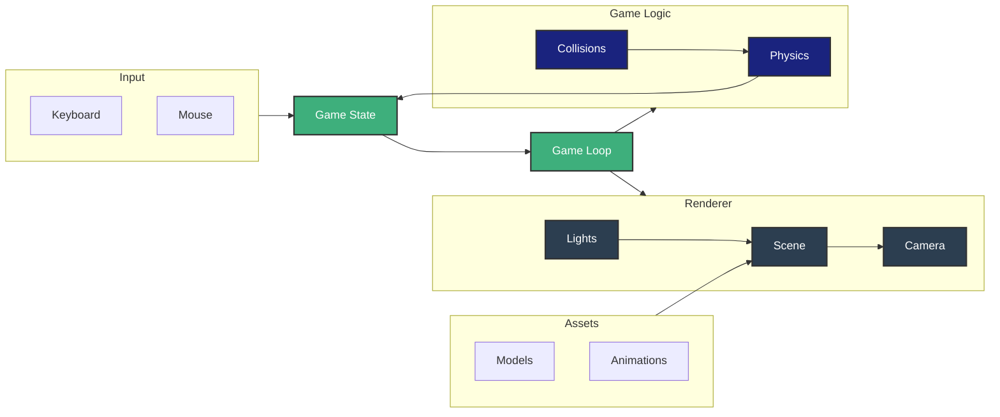

---
# try also 'default' to start simple
theme: penguin
colorSchema: 'dark'
layout: intro
# https://sli.dev/custom/highlighters.html
highlighter: shiki
title: Create a 3D multiplayer game with TresJS
themeConfig:
  logoHeader: /avatar.png
  eventLogo: https://assets.jsworldconference.com/logo_vuejs_amsterdam_b4b41918cb.svg
  eventUrl: 'https://vuejsnation.com/#schedule'
---

# Create a 3D multiplayer game with TresJS

<v-click>

  
</v-click>

<!-- 
Hello everyone, I hope you are having a great time at the conference and that you are as excited as me for this talk titled 
-->

---
layout: center
class: text-center flex flex-col items-center justify-center
---

<!-- 
So I couple of weeks back I made this question on my socials
-->

# Can you build a 3D game with Nuxt?

<v-click>
 
</v-click>

<!-- 
The answer is actually simple.
-->

---
layout: image-right
image: /dnd-selfie.jpg
---

# Yes

---
layout: center
---

# But, should you? 🤔

<v-click>
<h2 class="text-4xl text-center">😜</h2>
</v-click>

<!-- 
We are going to find out really soon. Don't worry. Before we get there, 
-->

---
layout: center
---

# First act

<v-click>

## Motivation

</v-click>

---
layout: two-cols
---
# I have always loved video games

::right::


<!-- 
I even play with my cat Geralt. Im pretty sure he loves playing with me
-->


---
layout: two-cols
---


::right::


 

---
layout: two-cols
---

<!-- 
But jokes aside, I was priviliged to grow up with some of the best video games of all time. Games like Crash Bandicoot, Final Fantasy VII, Metal Gear solid, The Witcher.
-->


# Motivation


::right::


<!-- 
I mean, look at those graphics. 

As a kid, all I ever wanted was to be a game developer. 
-->

---
layout: two-cols
---

# Baldur's Gate 3

Also in recent times, I've invested and unhealthy amount of hours (> 500 hours) to Baldur's Gate 3.

Made by Larian Studios, based on Dungeons and Dragons 5e.  <simple-icons-dungeonsanddragons class="text-red-500"/>

Amazing community.

<v-click>

## I love you Larian. 🫶

</v-click>

::right::


---
layout: center
---

# Let's build a 3D game

---

# Basic game



---

# The stack

<div class="flex justify-center items-center justify-start gap-8 h-300px">
    <v-click>
     <div class="rounded-lg bg-primary-700/40 shadow-lg p-4 w-20 h-20 flex items-center justify-center">
      
     </div>
    </v-click>
    <v-click>
        +
      <div class="rounded-lg bg-primary-700/40 shadow-lg p-4 w-20 h-20 flex items-center justify-center">
        <logos-nuxt-icon class="w-12"/>
      </div>
    </v-click>
    <v-click>
        +   
      <div class="rounded-lg bg-primary-700/40 shadow-lg p-4 w-20 h-20 flex items-center justify-center">
        <logos-nuxt-icon class="w-12"/>UI
      </div>
    </v-click>
</div>

---
layout: image-right
image: /space-game.png
---

# Why  TresJS?


- Best solution for building 3D scenes with Vue
- Based on ThreeJS and WebGL
- It's declarative
- 120K downloads/monthly
- Nuxt module available.


---
layout: iframe-right
url: https://ui3.nuxt.dev/components/modal
---

# Why Nuxt (UI)?

- Nuxt official UI library
- Tailwind based
- Typed
- Comfortable and easy to use.


---

# Game architecture


---
layout: two-cols
---

# Kaykit - Adventurers Character Pack

- Fully rigged
- Animated
- Low poly optimized models
- Free for personal and commercial use, no attribution required. (CC0 Licensed)
- Absolutely awesome and game-ready 🤩


<TwitterBadge handle="Kaylousberg" />

::right::


---

# State management

<div class="flex justify-center items-center justify-start gap-8 h-300px">
    <div class="rounded-lg bg-primary-700/40 shadow-lg p-4 w-20 h-20 flex items-center justify-center">
    
    </div>
      +
    <div class="rounded-lg bg-primary-700/40 shadow-lg p-4 w-20 h-20 flex items-center justify-center">
      <logos-nuxt-icon class="w-12"/>
    </div>
      +   
    <div class="rounded-lg bg-primary-700/40 shadow-lg p-4 w-20 h-20 flex items-center justify-center">
      <logos-nuxt-icon class="w-12"/>UI
    </div>
    <v-click>
       +   
      <div class="rounded-lg bg-primary-700/40 shadow-lg p-4 w-20 h-20 flex items-center justify-center">
        <logos-pinia class="text-4xl"/>
      </div>
    </v-click>
</div>

---
layout: center
---

# But gaming is always better with friends.

<v-click>


</v-click>

---

# Multiplayer

<div class="flex justify-center items-center justify-start gap-8 h-300px">
  <div class="rounded-lg bg-primary-700/40 shadow-lg p-4 w-20 h-20 flex items-center justify-center">
    
  </div>
      +
  <div class="rounded-lg bg-primary-700/40 shadow-lg p-4 w-20 h-20 flex items-center justify-center">
    <logos-nuxt-icon class="w-12"/>
  </div>
      +   
  <div class="rounded-lg bg-primary-700/40 shadow-lg p-4 w-20 h-20 flex items-center justify-center">
    <logos-nuxt-icon class="w-12"/>UI
  </div>
   +   
  <div class="rounded-lg bg-primary-700/40 shadow-lg p-4 w-20 h-20 flex items-center justify-center">
    <logos-pinia class="text-4xl"/>
  </div>
  <v-click>
       +   
    <div class="rounded-lg bg-primary-700/40 shadow-lg p-4 w-20 h-20 flex items-center justify-center">
     <svg xmlns="http://www.w3.org/2000/svg" width="32" height="32" viewBox="0 0 32 32"><!-- Icon from All by undefined - undefined --><g fill="none"><g clip-path="url(#unjsNitro4)"><path fill="url(#unjsNitro1)" fill-rule="evenodd" d="M28.173 5.616C22.438-1.107 12.34-1.907 5.617 3.828s-7.524 15.834-1.789 22.557s15.834 7.523 22.557 1.788s7.523-15.834 1.788-22.557m-7.97 8.398c.616 0 1.01.668.7 1.202l-.089.153l-6.038 9.935a.62.62 0 0 1-.529.297h-.576a.604.604 0 0 1-.585-.755l1.638-6.335a.8.8 0 0 0-.774-1h-2.517a.8.8 0 0 1-.774-1l2.472-9.565a.74.74 0 0 1 .716-.544q.061 0 .107.002h2.535a.8.8 0 0 1 .793.908l-.016.114l-.966 5.653a.8.8 0 0 0 .788.935z" clip-rule="evenodd"/><path fill="url(#unjsNitro2)" fill-rule="evenodd" d="M28.173 5.616C22.438-1.107 12.34-1.907 5.617 3.828s-7.524 15.834-1.789 22.557s15.834 7.523 22.557 1.788s7.523-15.834 1.788-22.557m-7.97 8.398c.616 0 1.01.668.7 1.202l-.089.153l-6.038 9.935a.62.62 0 0 1-.529.297h-.576a.604.604 0 0 1-.585-.755l1.638-6.335a.8.8 0 0 0-.774-1h-2.517a.8.8 0 0 1-.774-1l2.472-9.565a.74.74 0 0 1 .716-.544q.061 0 .107.002h2.535a.8.8 0 0 1 .793.908l-.016.114l-.966 5.653a.8.8 0 0 0 .788.935z" clip-rule="evenodd"/><mask id="unjsNitro0" width="32" height="33" x="0" y="0" maskUnits="userSpaceOnUse" style="mask-type:alpha"><path fill="url(#unjsNitro3)" d="M16 32.001c8.837 0 16-7.163 16-16s-7.163-16-16-16s-16 7.163-16 16s7.163 16 16 16"/></mask><g filter="url(#unjsNitro5)" mask="url(#unjsNitro0)"><path fill="#fff" d="M.89 10.741a16 16 0 1 0 30.365.434l-4.652 1.471a11.12 11.12 0 1 1-21.106-.3z"/></g></g><defs><radialGradient id="unjsNitro1" cx="0" cy="0" r="1" gradientTransform="matrix(31.2006 0 0 318.168 3.2 16)" gradientUnits="userSpaceOnUse"><stop stop-color="#31B2F3"/><stop offset=".474" stop-color="#F27CEC"/><stop offset="1" stop-color="#FD6641"/></radialGradient><radialGradient id="unjsNitro2" cx="0" cy="0" r="1" gradientTransform="matrix(31.2006 0 0 318.168 3.2 16)" gradientUnits="userSpaceOnUse"><stop stop-color="#31B2F3"/><stop offset=".474" stop-color="#F27CEC"/><stop offset="1" stop-color="#FD6641"/></radialGradient><radialGradient id="unjsNitro3" cx="0" cy="0" r="1" gradientTransform="matrix(31.2 0 0 318.162 3.2 16.001)" gradientUnits="userSpaceOnUse"><stop stop-color="#F27CEC"/><stop offset=".484" stop-color="#31B2F3"/><stop offset="1" stop-color="#7D7573"/></radialGradient><clipPath id="unjsNitro4"><path fill="#fff" d="M0 0h32v32H0z"/></clipPath><filter id="unjsNitro5" width="52" height="41.26" x="-10" y=".741" color-interpolation-filters="sRGB" filterUnits="userSpaceOnUse"><feFlood flood-opacity="0" result="BackgroundImageFix"/><feBlend in="SourceGraphic" in2="BackgroundImageFix" result="shape"/><feGaussianBlur result="effect1_foregroundBlur_7_821" stdDeviation="5"/></filter></defs></g></svg>
    </div>
  </v-click>
</div>

---
layout: two-cols
---

# Experimental Nitro websockets


- 🚀 Built-in WebSocket 
- 🔄 Real-time bidirectional communication
- 🎮 Perfect for game state synchronization

::right::

````md magic-move
```ts
// nuxt.config.ts

nitro: {
},
```
```ts {3-5}
// nuxt.config.ts

nitro: {
  experimental: {
    websocket: true,
  },
},
```
````

<!-- 
So since we mentioned that everything is better with friends, let's forget about live coding and lets do a live gaming, so I will love to invite some familiar faces to stage, please welcomeAlex, Daniel and Jakub
-->

---
layout: center
---

# Second act

<v-click>

## The game

</v-click>

---
layout: center
---

# Third act

<v-click>

## Lessons learned

</v-click>

---
layout: two-cols
---

# Organize your 3D assets 

In vue components.


::right::

<v-click>

`Character.vue`

```vue
<script setup lang="ts"> 
  const props = defineProps<{
    character: Character
    player: Player
  }>()
  const { scene: model } 
    = getResource('models', props.player.character)
</script>

<template>
  <TresGroup>
    <primitive
      ref="modelRef"
      :name="player.name"
      :object="model"
    />
  </TresGroup>
</template>
```

</v-click>

---
layout: two-cols
---

# Nuxt UI for Game UI


::right::

```ts {*|6-20}
const handlePointerEnter = (e: ThreeEvent<PointerEvent>) => {
  isHovering.value = true
  outlineObject(e.object)
  setCursor(isLocked.value ? 'locked' : 'pointer')
  uiStore.contextMenu.enabled = true
  uiStore.setContextMenuItems(isLocked.value
    ? [{
        label: 'Lockpick',
        icon: 'i-lucide-lock',
        onSelect: lockpickAction,
      }]
    : [
        {
          label: 'Open',
          onSelect: () => {
            isOpen.value = true
            syncChestState()
          },
        },
      ])
  e.stopPropagation()
}
```


---
layout: two-cols
---

# Use nuxt-content for meta data

```json
{
  "name": "Artificer",
  "slug": "artificer",
  "icon": "/icons/classes/artificer.svg",
  "hitDie": "d8",
  "primaryAbility": "Intelligence",
  "savingThrows": ["Constitution", "Intelligence"],
  "proficiencies": {
    "armor": ["Light Armor", "Medium Armor", "Shields"],
    "weapons": [
      "Simple Weapons",
      "Hand Crossbows",
      "Heavy Crossbows"
    ],
  }
}
```
::right::


---
layout: two-cols
---

`stores/useGameStore.ts`

````md magic-move
```ts
async function loadCharacterTemplates() {

}
```
```ts {3-9}
async function loadCharacterTemplates() {
  // Load all collections
  const [templates, races, classes, spells, cantrips] = await Promise.all([
    queryCollection('origins').all(),
    queryCollection('races').all(),
    queryCollection('classes').all(),
    queryCollection('spells').all(),
    queryCollection('cantrips').all(),
  ])
}
```
````

::right::

`content.config.ts`

````md magic-move
```ts
export default defineContentConfig({
  collections: {

  }
})
```
```ts {3-10}
export default defineContentConfig({
  collections: {
     races: defineCollection({
      type: 'data',
      source: 'races/**.json',
      schema: z.object({
        name: z.string(),
        slug: z.string(),
        description: z.string(),
        features: z.array(z.string()),
      }),
    }),
  }
})
```
````

---
layout: two-cols
---
# Use <logos-pinia /> for the game state

```ts
export const useGameStore = defineStore('game', () => {
  const players = ref([])

// Game Mode
  const mode = ref('single')
  const isMultiplayer = computed(() => mode.value === 'multiplayer')

    // Characters
  const characterTemplates = ref([])
  const characters = ref([])

  return { players, characterTemplates, characters, mode, isMultiplayer }
})
```

::right::


---
layout: two-cols
---

# Dont store any ThreeJS object.

Use `shallowRef` and `shallowReactive` as much as possible when holding references to ThreeJS objects.


::right::


---

# Nitro websockets for the multiplayer win 💪🏻

````md magic-move
```ts
export default defineEventHandler({
 
})
```
```ts {2-12}
export default defineEventHandler({
  open: (peer) => {
    connectedPeers.set(peer.id, peer)
    peer.subscribe(global)
    // Send confirmation message to the peer when they connect
    peer.send(JSON.stringify({
      type: 'CONNECTION_ESTABLISHED',
      message: 'Successfully connected to websocket server',
      peerId: peer.id,
    }))
    syncState()
  },
})
```
```ts {2-18}
export default defineEventHandler({
  message: (peer, message) => {
    const data = JSON.parse(message.text())

    const messageHandlers = {
      PLAYER_CONNECTION_REQUEST: (peer, data) => {
        handlePlayerConnection(peer, data.userId, data.username)
      },
      PLAYER_CONNECTION_RESPONSE: (peer, data) => {
        handlePlayerConnectionResponse(peer, data.userId, data.username)
      },
    } 

    const handler = messageHandlers[data.type]
    if (handler) {
      handler(peer, data)
    }
  }
})
```
````

---
layout: two-cols
---

Send messages to server

```ts
const handleFloorClick = (e: ThreeEvent<PointerEvent>) => {
  const newPosition = { x: e.point.x, y: 0, z: e.point.z }
  sendMsg({
    type: 'UPDATE_PLAYER_POSITION',
    lobbyId: lobbyStore.currentLobbyId,
    position: [newPosition.x, newPosition.y, newPosition.z],
  })
}
```

::right::

<v-click>

Receive messages from server

```ts {1|3-9}
const { data } = useWebSocket('/api/websocket')

watch(data, (newData) => {
  const payload = JSON.parse(newData)

  if (data.type === 'CONNECTION_ESTABLISHED') {
    userStore.setPeerId(data.peerId)
    handleUserConnection()
  }
})
```

</v-click>

---
layout: center
---

# Can you build a 3D game with Nuxt?

<!-- 
The answer is actually simple.
-->

---
layout: image-right
image: /dnd-selfie.jpg
---

# Yes

---
layout: center
---

# But, should you? 🤔

---
layout: image-right
image: /dnd-selfie-zoom.jpg
---

# Why not? 

<v-clicks>

- It's fun 🥳
- It provides a nice server and UI layers
- The DX is the best out there.
- It blends well with TresJS
- It's a great way of learning game mechanisms with a familiar stack.
- The community is amazing 🤗 💚.
  
</v-clicks>

---
layout: two-cols
---

# Next steps (DLC)

<v-clicks>

- Check the repo for the full code 
- I'm gonna be streaming the game progress every Thursday 6pm CET on Twitch
- Contribute if you want to.
- Check the discord for the latest updates.

</v-clicks>

::right::


---

## Contributors

<TheContributors />

---
layout: two-cols
---


::right::

<iframe class="rounded shadow-lg" src="https://github.com/sponsors/Tresjs/card" title="Sponsor Tresjs" height="225" width="400" style="border: 0;"></iframe>

---
layout: presenter
twitter: '@alvarosabu'
twitterUrl: https://twitter.com/alvarosabu
presenterImage: /speaking-avatar.jpg
---

# Alvaro Saburido

Developer Experience Engineer at <a href="https://www.storyblok.com/"><logos-storyblok-icon /> Storyblok</a>

- Barcelona, Spain 🇻🇪 🇪🇸
- Creating content on <a href="https://www.youtube.com/channel/AlvaroDevLabs" ><logos-youtube-icon mr-1 />AlvaroDevLabs</a>
- Blog & Portfolio <a href="https://alvarosaburido.dev">alvarosaburido.dev</a>
- Say hi at <a href="https://bsky.app/profile/alvarosaburido.dev"><logos-bluesky mr-1 />@alvarosaburido.dev</a>
- <a href="https://twitter.com/alvarosabu"><logos-x mr-1 />@alvarosabu</a>


---
layout: new-section
---

# Thank you 🙏


